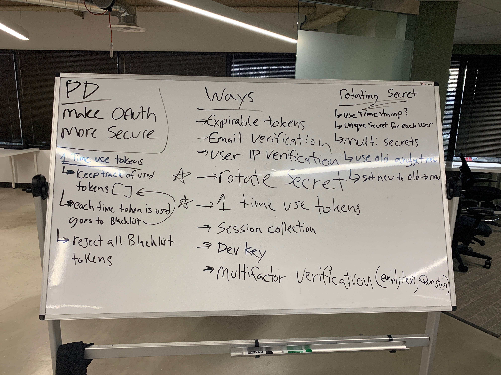

 LAB
=================================================

## 18-authorization

### Author: Tanner Seramur

### Links and Resources
* [repo](https://github.com/TannerSeramur/18-authorization)
* [travis](http://xyz.com)
* [back-end](http://xyz.com) 

### Modules
#### `middleware.js`
#### `router.js`
#### `users-model.js`
### Routes
#### `/signup`
* enter in username in password to create a account
* give user back a token
#### `/signin`
* user can use token or login info to 'log in'
* tokens expire after 5 min
* tokens only have one time use
* should genorate and send back a token

### Security changes made: 
Tokens now have a 5 min experation time ✅  
Tokens are now 1 time use ✅

### Setup
#### `.env` requirements
* `PORT` - 3000

#### Running the app
* `npm start`
* Endpoint: `/signin`
  * Returns a JSON object with token
* Endpoint: `/signup`
  * Returns a JSON object with with token if valid sign in
  

#### UML

